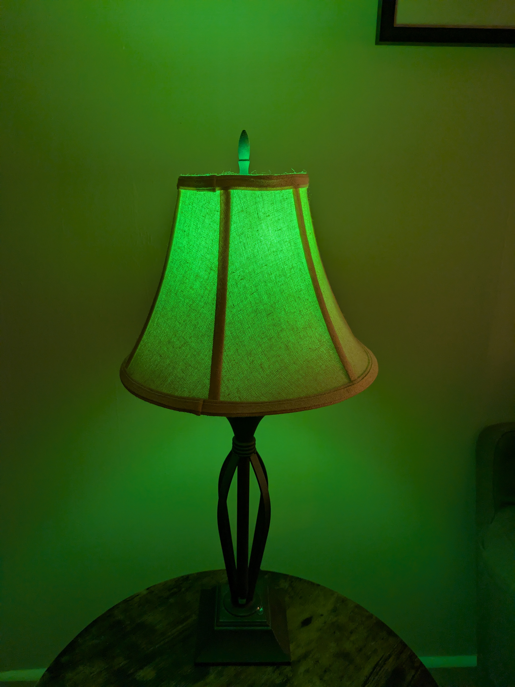
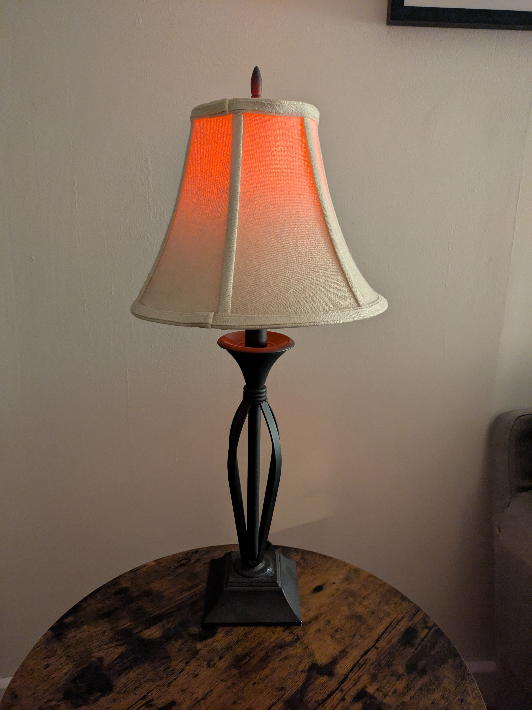
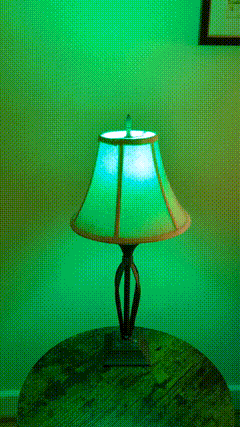

# crypto_lamp
A python script for smart lightbulbs that shows how badly you're losing money in crypto. Glows green when you're up, red when you're down. Larger swings trigger flashing. This lets you be aware of your mistakes anywhere in your home, automatically.

| 👍 Small rally | 👎 Minor dip | 🤑 📈 Pump | 😵 📉 Crash |
|:---:|:---:|:---:|:---:|
|  |  |  |  |

## You will need:
* Phillips Hue Color Bulb + a Hue Bridge
* A lamp
* A computer capable of running Python. A raspberry pi would work fine
* A CoinMarketCap API key (free)

## Setup

#### Lightbulb setup
* Set up your Hue bridge + bulb. Make sure it's plugged in
* Find the IP of your Hue bridge and add it to the `crypto_lamp.config` file under `hue_bridge_ip`
* Follow the instructions at [Hue API v2 Getting Started](https://developers.meethue.com/develop/hue-api-v2/getting-started/) to obtain a user token (application key)
* Add the application key to `crypto_lamp.config` under `hue_user_token`
* To find your light ID, make a GET request to `https://<bridge ip address>/clip/v2/resource/light` with your application key in the header:
  ```
  GET /clip/v2/resource/light HTTP/1.1
  hue-application-key: your_application_key
  ```
* In the response, look for the light you want to use and find its `rid` value for the `service` with `rtype` of `light`. This should be a UUID. **Note**: This is NOT the light ID of the bulb. The array of services is nested inside of the device object.

```
{
    "id": "{Ignore this}",
    "metadata": {
        "name": "Your Light Name",
        "archetype": "sultan_bulb"
        },
    "services": [
        ...
        {
            "rid": "79dec3ce-6873-46ed-0bb9-f08f1eb635e9",
            "rtype": "light"
        },
        ...
        ]
}
```
* Add this light ID to `crypto_lamp.config` under `hue_light_id`

#### CoinMarketCap API setup
* Go to [CoinMarketCap](https://coinmarketcap.com/api/) and sign up for a free API key
* After signing up, go to your dashboard and copy your API key
* Add this API key to `crypto_lamp.config` under `cmc_api_key`

To track a coin, the script uses CoinMarketCap's [API](https://coinmarketcap.com/api/). You'll need to use the coin's symbol (like BTC, ETH, etc.) as a parameter for the script.

#### Python setup
You will need a machine capable of running Python. If you do not have python installed, look up how to install it for your OS.

To install all required dependencies, run:

```
pip install -r requirements.txt
```

**Note:** Depending on your Python installation, you might need to use `pip3` instead of `pip`:

```
pip3 install -r requirements.txt
```

## Running the script

To run the script, navigate to the root folder of this project in your terminal and enter:

```
python am_i_broke.py
```

**Note:** Depending on your Python installation, you might need to use `python3` instead of `python`:

```
python3 am_i_broke.py
```

There are two ways to calculate gains. By default, the script will use the 24 hour percentage change of the given coin or stock.

### Tracking Crypto
Using the symbol of the coin you want to track, run `python am_i_broke.py --crypto {coin symbol}`. For example, to track Bitcoin: `python am_i_broke.py --crypto BTC`.

### Tracking Stocks
To track stocks, use the `--stock` parameter followed by the stock ticker symbol:

```
python am_i_broke.py --stock {stock ticker symbol}
```

For example, to track Google: `python am_i_broke.py --stock GOOG`.

### Verbose Mode
To see detailed information about the asset you're tracking, add the `-v` flag:

```
python am_i_broke.py --crypto BTC -v
python am_i_broke.py --stock AAPL -v
```

This will display the current price, market cap, and 24-hour change percentage.

### Recurring Mode
To run the script automatically at regular intervals without setting up cron jobs, use the `--recurring` flag:

```
python am_i_broke.py --crypto BTC --recurring
```

By default, this will check the asset every 15 minutes. You can specify a custom interval in minutes:

```
python am_i_broke.py --stock AAPL --recurring 30
```

This will check Apple stock every 30 minutes. The script will run continuously until you stop it with Ctrl+C.

#### 24 Hour Mode (default)
This uses the 24hr percent change CoinMarketCap returns for the given coin. This is the default and does not require additional command line arguments.

#### Delta Mode
This calculates the percent delta between each time your run the script. The first time you run the script in this mode will always treat the percent change as 0 since there was no previous data. The previous balance is stored in a `crypto_delta.dat` file. If you modify this file the script may not run properly. Deleting the file will remove previous data. Add the `-d` argument to the script to run in delta mode, i.e. `python am_i_broke.py -d --crypto xrp`. If switching to a different coin it is probably a good idea to delete `crypto_delta.dat`.

## Scheduling
If you are running the script from a Linux device or Mac, use `cron` to schedule the script. Not sure the best way on Windows, but I'm sure there's plenty. Alternatively, you can use the built-in `--recurring` option described above.

## Adjust parameters
There are a few parameters in the script you can tweak. Edit `am_i_broke.py` to change them. 

* `GAINS_MAX` - What percent gains should make the light shine brightest. It will increase from brightness from 0% to whatever this value is. If it goes pass this value it will start flashing. You should tweak this based on how often you are running the script. For example if you are running it daily, 20% may be a good max number for gains, but if you are running it every 5 minutes, it could be as low as a few percents.
* `LOSS_MAX` - Same as above, but for losses. This one is negative

## Troubleshooting
Make sure the values in the config file do not have any whitespace between the `=`. This will cause them to be parsed incorrectly

The first time you run this script in delta mode, or if you have deleted the generated `crypto_delta.dat` file, the lamp will always be green on the first run. This is because without the file it treats the previous amount as $0. Subsequent runs will be correct.

If running in delta mode, but switching between data sources, the light will probably flash. Currently a single `crypto_delta.dat` file is used to keep track of previous amount regardless of where the data is coming from. So if it was tracking the market cap of BTC and suddenly starts tracking ETH, it's going to think you lost A LOT of money. Delete the `crypto_delta.dat` file if you want to switch sources.

Do not modify the `crypto_delta.dat` file. This could cause the script to crash. If you suspect that file has become corrupted, just delete it and run the script again.

Brightness is based on your `GAINS_MAX` and `LOSS_MAX` values. Adjust these params based on how often you run the script, and how much money expect to lose or make. Any gains or losses over these will trigger maximum brightness plus an annoying flashing effect.
